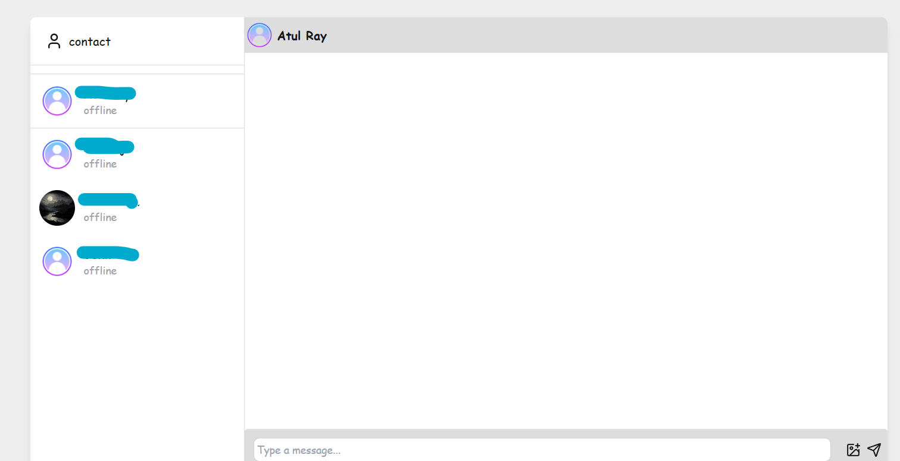
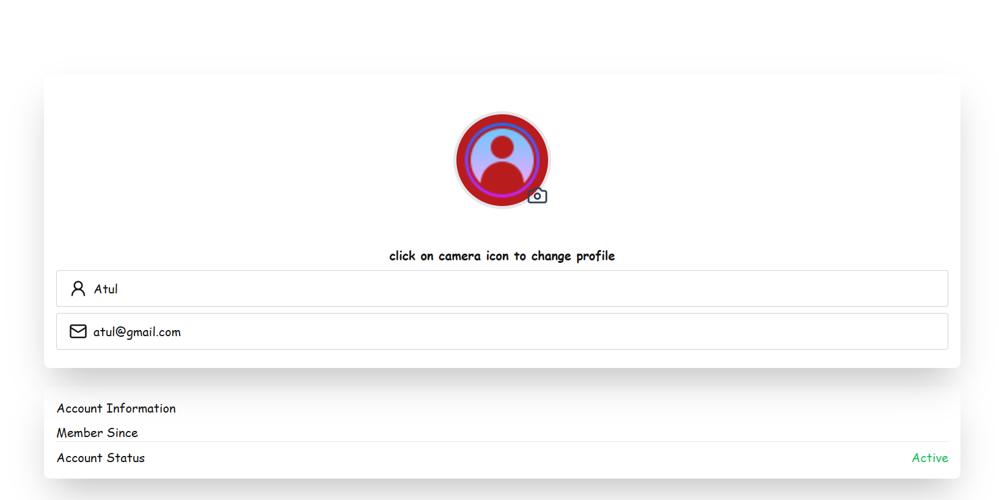
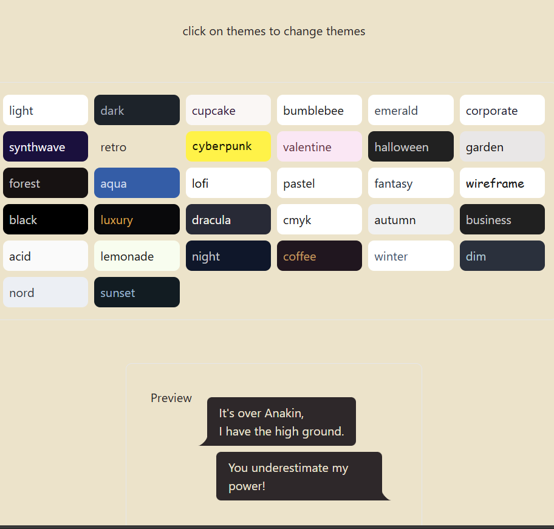

# Simple Chat Application

A real-time chat application built using the MERN stack, Socket.IO, JWT authentication, Zustand for state management, DaisyUI, Tailwind CSS for styling, and Cloudinary for image uploads.

## Features

- Real-time messaging using Socket.IO
- JWT authentication for secure login and registration
- State management with Zustand
- Responsive UI with DaisyUI and Tailwind CSS
- Image uploads with Cloudinary

## Tech Stack

- **MongoDB**: NoSQL database for data storage
- **Express**: Backend framework for building APIs
- **React**: Frontend library for building user interfaces
- **Node.js**: JavaScript runtime for the backend
- **Socket.IO**: Real-time, bi-directional communication
- **JWT**: JSON Web Tokens for authentication
- **Zustand**: State management for React
- **DaisyUI**: Tailwind CSS components
- **Tailwind CSS**: Utility-first CSS framework
- **Cloudinary**: Cloud-based image management

## Screenshots

 ### Login Page 
  
 ### Chat Interface 
  
 ### User Profile 
 
 ### Themes
 

